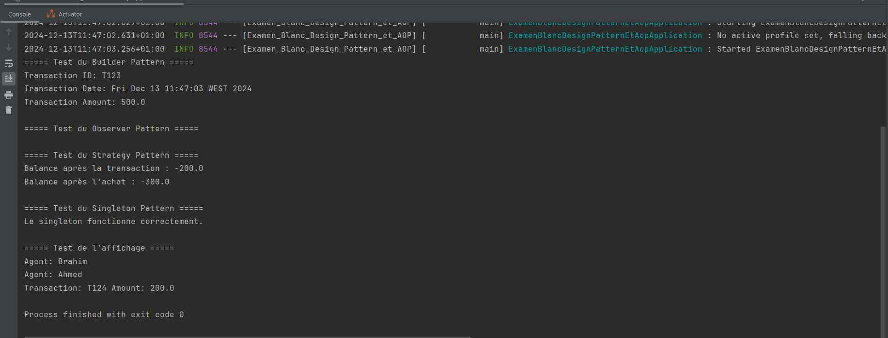

#Examen Blanc Brahim NAJI

### 1. Diagramme de Classe - Description Générale

#### Classes
- **Transaction** : Représente une transaction effectuée par un agent. Chaque transaction a un identifiant unique, une date, un montant, et un type (achat ou vente).
- **Agent** : Un agent peut avoir plusieurs transactions et peut observer les transactions d'autres agents via un modèle **Observer**. Les agents peuvent s'abonner pour recevoir des notifications de nouvelles transactions ou changements pertinents.
- **Evenement** : Représente un événement lié à une transaction ou un agent, comme une notification ou une action importante.
- **Soucription** : Gère l'abonnement entre les agents, permettant à un agent de suivre un autre pour recevoir des notifications spécifiques.
- **AgentContainer** : Un **Singleton** qui gère un ensemble d'agents. Il assure que tous les agents sont centralisés et accessibles via une seule instance.
- **HDMIDisplay** : Interface utilisée pour afficher les informations relatives à l'**AgentContainer** sur un écran via HDMI.
- **ConsoleDisplay** : Implémentation concrète de **HDMIDisplay**, permettant d'afficher les informations de l'**AgentContainer** dans la console.

#### Relations Principales
- Un **Agent** peut avoir plusieurs **Transactions** (relation un-à-plusieurs).
- Un **Agent** peut observer les actions d'un ou plusieurs autres agents, ce qui fait intervenir le **Pattern Observer**.
- **TransactionType** définit les types de transactions (achat ou vente).
- **HDMIDisplay** et **ConsoleDisplay** sont des interfaces d'affichage permettant de visualiser les informations de l'**AgentContainer** soit sur un écran HDMI, soit dans la console.

---

### 2. Design Patterns Utilisés

#### **Builder Pattern** - **Transaction**
Le **Builder Pattern** est utilisé pour créer des objets complexes de manière fluide et sans erreurs, particulièrement pour des objets avec plusieurs paramètres. Il permet de construire des objets étape par étape.

**Exemple d'utilisation** :
La classe **Transaction** utilise le Builder Pattern pour créer des instances de manière flexible sans manipuler de nombreux constructeurs.

```java
public class Transaction {
    private final String id;
    private final Date date;
    private final Double amount;
    private final TransactionType type;

    private Transaction(Builder builder) {
        this.id = builder.id;
        this.date = builder.date;
        this.amount = builder.amount;
        this.type = builder.type;
    }

    public static class Builder {
        private String id;
        private Date date;
        private Double amount;
        private TransactionType type;

        public Builder id(String id) {
            this.id = id;
            return this;
        }

        public Builder date(Date date) {
            this.date = date;
            return this;
        }

        public Transaction build() {
            return new Transaction(this);
        }
    }
}
```

#### **Observer Pattern** - **Agent**
Le **Observer Pattern** permet à un agent de notifier plusieurs autres agents des changements ou événements (comme une nouvelle transaction). Chaque agent peut s'abonner à un autre pour recevoir ces notifications.

**Exemple d'utilisation** :
L'agent peut notifier les autres agents lorsqu'une nouvelle transaction est ajoutée.

```java
public class Agent {
    private String name;
    private List<Agent> observers = new ArrayList<>();
    private NotificationStrategy strategy;

    public void subscribe(Agent observer) {
        observers.add(observer);
    }

    public void addTransaction(Transaction transaction) {
        notifyObservers(transaction);
    }

    private void notifyObservers(Transaction transaction) {
        for (Agent observer : observers) {
            observer.update(this, transaction);
        }
    }

    public void update(Agent source, Transaction transaction) {
        strategy.process(transaction);
    }
}
```

#### **Strategy Pattern** - **NotificationStrategy**
Le **Strategy Pattern** permet à un agent de choisir la manière dont il traite les notifications. L'agent peut avoir différentes stratégies, comme un envoi par email ou par message, et choisir celle qui convient selon les besoins.

**Exemple d'utilisation** :
Chaque agent peut choisir une stratégie spécifique pour traiter les notifications de nouvelles transactions.

```java
public interface NotificationStrategy {
    void process(Transaction transaction);
}

public class ScoringStrategy implements NotificationStrategy {
    private Double balance = 0.0;

    @Override
    public void process(Transaction transaction) {
        balance += transaction.getAmount() * 
            (transaction.getType() == TransactionType.SALE ? 1 : -1);
    }
}
```

#### **Singleton Pattern** - **AgentContainer**
Le **Singleton Pattern** assure qu'il n'existe qu'une seule instance d'un objet. Dans ce cas, le **AgentContainer** gère tous les agents du système et garantit une gestion centralisée via une seule instance.

**Exemple d'utilisation** :
Le **AgentContainer** garantit qu'il n'y a qu'une seule instance pour gérer l'ensemble des agents.

```java
public class AgentContainer {
    private static AgentContainer instance;

    private AgentContainer() {}

    public static AgentContainer getInstance() {
        if (instance == null) {
            instance = new AgentContainer();
        }
        return instance;
    }
}
```

#### **HDMIDisplay et ConsoleDisplay**
Ces deux classes implémentent une interface commune, **HDMIDisplay**, permettant de gérer différents types d'affichage. Le **HDMIDisplay** est utilisé pour afficher les informations sur un écran HDMI, tandis que **ConsoleDisplay** permet d'afficher les informations dans la console.

Cela permet une flexibilité d'affichage sans dépendre d'une seule implémentation.

---

## Test 


## Autres Design Patterns utiles

Decorator Pattern : Pour ajouter des fonctionnalités supplémentaires à un agent ou à une transaction (par exemple, des notifications personnalisées, des logs détaillés, etc.), 


Voici une version plus courte de la réponse pour la question 6 :

## Implémentation des aspects techniques

#### a. **Journalisation avec @Log**
Un aspect pour enregistrer la durée d'exécution des méthodes annotées avec `@Log`, permettant de suivre les performances et identifier les goulots d'étranglement.

#### b. **Caching avec @Cachable**
Un aspect qui met en cache les résultats des méthodes annotées avec `@Cachable`, évitant de recalculer des valeurs fréquemment demandées et améliorant les performances.

#### c. **Sécurité avec @SecuredBy**
Un aspect qui vérifie les rôles des utilisateurs avant d'exécuter les méthodes annotées avec `@SecuredBy`, garantissant que seules les personnes autorisées y accèdent.

